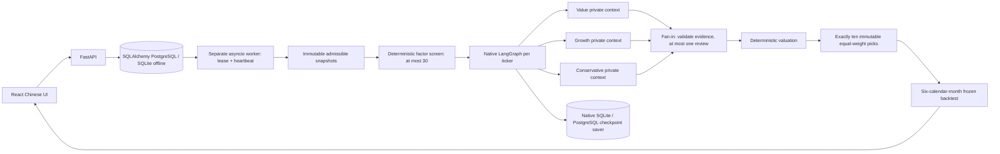

# Frozen implementation architecture

Status: interface freeze, 2026-10-08. Binding V2 and AGENTS.md govern this document.
`backend/finagent/contracts.py` is the executable schema source. This file fixes
the boundaries needed for independent implementation; it does not claim that
providers, workers, or the UI have passed integration tests.



## Schemas and chronology

All public models forbid extra fields, reject naive timestamps, and are frozen.
Nested domain objects are frozen models and tuples, so mutation cannot quietly
change evidence. Serialize with `model_dump(mode="json")`; reload using the
specific model's `model_validate`. SQL JSON columns persist those envelopes;
they are not substitutes for the typed boundary checks.

`MarketBar` and `FinancialSnapshot` include ticker, observation `as_of`, actual
`available_at`, source/URI/hash, currency, corporate-action basis, PIT status,
and DEMO/REAL mode. `ResearchInput` rejects future observations and mixed
ticker/mode data. `EvidenceSnapshot` rejects future or duplicate evidence and
cannot label a mixture of unverified items PIT_VERIFIED. Publication time, not
financial period end, controls admissibility. Real data intake additionally
requires a verified source bundle; passing a Pydantic model alone is not proof.

DEMO values are synthetic. DEMO PIT_VERIFIED means internal synthetic chronology
is consistent; it does not authenticate actual historical financial facts. A
historical synthetic freeze is a simulated event. Actual job creation and audit
timestamps remain current wall-clock timestamps. Real historical replay carries
the retrospective nature and LLM historical-knowledge limitation as warnings.

`PersonaReport` contains assumptions, evidence IDs, risk flags, common 12-month
horizon, currency/basis, model/prompt versions, and target or explicit abstention.
The manager verifies references and comparability. `ValuationResult` separates
fair value, target_12m and entry price. It checks entry = target × (1−margin),
with tolerance for cent rounding. Missing target requires abstention.

`FrozenSignal` contains ten unique ranked picks, each weight 0.1, input hashes,
configuration hash and immutable versions. There is no partial frozen primary
signal. A shortfall is the run's `INSUFFICIENT_ELIGIBLE_STOCKS` status with its
available research and explicit exclusions. REAL unverified signals are rejected.

`BenchmarkList` requires ten canonical unique tickers, original publication
timestamp and HTTP(S) source URL. Import does not authenticate publication or
convert PIT_UNVERIFIED into verified. Absent/unverified original Seeking Alpha
list produces no SA returns or excess-return number.

## Frozen callable interfaces

All provider methods and quant/backtest functions below are synchronous. The
worker bounds ticker tasks with a semaphore and runs blocking provider IO with
`asyncio.to_thread` when needed. Research graph invocation is asynchronous.

```python
# backend/finagent/data.py
provider_for(mode: Mode) -> DataProvider
DataProvider.universe(period: str, decision_at: datetime) -> UniverseSnapshot
DataProvider.research_input(ticker: str, decision_at: datetime) -> ResearchInput
DataProvider.bars(ticker: str, start: date, end: date) -> tuple[MarketBar, ...]
DataProvider.actions(ticker: str, start: date, end: date) -> tuple[CorporateAction, ...]
# ProviderUnavailable: explicit terminal missing-configuration/coverage error.

# backend/finagent/quant.py
screen_candidates(inputs: Sequence[ResearchInput], limit: int = 30) -> tuple[ScreenedCandidate, ...]
valuate(input: ResearchInput, reports: Sequence[PersonaReport], safety_margin: float = .2) -> ValuationResult
freeze_signal(results: Sequence[ResearchResult], *, run_id: str, period: str,
              decision_at: datetime, frozen_at: datetime, mode: Mode,
              config_hash: str, max_per_sector: int = 4) -> FrozenSignal | None

# backend/finagent/agents.py
async research_stock(input: ResearchInput, research_mode: ResearchMode, *,
                     checkpointer=None, thread_id: str | None = None,
                     safety_margin: float = .2) -> ResearchResult

# backend/finagent/backtest.py
run_backtest(signal: FrozenSignal, provider: DataProvider, *, backtest_id: str,
             as_of: datetime, benchmark: BenchmarkList | None = None,
             transaction_cost_bps: float = 0, slippage_bps: float = 0,
             policy: str = "PRIMARY") -> BacktestResult
```

Provider implementation may define MarketDataProvider/FinancialsProvider/
BenchmarkListProvider protocols and compose them behind DataProvider. Missing
actions must be distinguishable from a verified empty action interval. A REAL
provider cannot satisfy requested historical coverage by using demo data.

Root owns the SQLAlchemy `Store` API: submit, claim, heartbeat, finish, fail,
research/save_research, artifact/put_artifact, event/events. Root may expose its
internal signatures without changing public contracts. HTTP response envelopes
contain typed JSON payloads and durable job/run status; UI relies on OpenAPI.

## Persistence and job leases

Production application state uses SQLAlchemy with PostgreSQL; offline tests use
SQLite. Native LangGraph SQLite checkpoint saver is for offline development;
deployed configuration uses native PostgreSQL saver. Do not implement a custom
checkpoint emulation. Checkpoint thread identity includes run/ticker/graph version.

One orchestrator job per run or backtest is sufficient. Durable per-ticker
research is uniquely keyed by run+ticker and reused before graph invocation.
The job fingerprint uses canonical request plus exact versions/configuration.
Explicit idempotency keys reject incompatible reuse, never overwrite outputs.

| State | Allowed transition | Condition |
|---|---|---|
| QUEUED | RUNNING | atomic claim, next_attempt_at reached |
| RETRY / retryable queued | RUNNING | atomic claim, bounded attempt budget |
| RUNNING | RUNNING | owner+lease token fenced heartbeat |
| RUNNING | COMPLETED | same owner/token fenced result commit |
| RUNNING | RETRY / QUEUED | transient error with capped backoff |
| RUNNING | FAILED | terminal data/PIT error or exhausted attempts |
| RUNNING expired | RUNNING (new owner/token) | atomic takeover; old owner cannot commit |

Lease expiry recovery uses an atomic SQL compare-and-swap predicate, not
read-then-unconditional-update. Production claims may use PostgreSQL row locks;
SQLite tests verify the same observable fencing behavior. Heartbeats use actual
UTC wall clock, never the research cutoff. Job IDs remain stable across retry.
Stock result and immutable signal commits must be idempotent; stale owner cannot
mark job completed. FastAPI never runs research in BackgroundTasks.

## Backtest interval and accounting

Decision admissibility is independent of execution price. Execution starts at
the first actual tradable open strictly after the signal's freeze instant and,
when a verified SA list is compared, after its publication instant. All included
portfolios share actual start/end sessions. Six months means calendar months;
the end uses the first eligible common session at/after the anniversary. Missing
coverage/actions produces UNAVAILABLE or VALIDATION_FAILED. Unmatured window
produces PENDING and no realized returns. Future post-decision bars are allowed
only in this separate simulation; changing them cannot change a frozen signal.

Raw prices plus explicit splits/dividends avoid double adjustment. All included
portfolios must share the corporate-action convention and costs. Excess is in
percentage points: `(portfolio_return − benchmark_return) * 100`. Primary equal
weight and optional limit-entry experiment remain separate policies. Nonfilled
limit allocations remain cash and affect full-portfolio return.

## NVDA illustration

Only the DEMO/test illustration uses Value=190, Growth=240, Conservative=160;
weights .5/.3/.2 give target 199 and a 20% margin gives entry 159.20. These are
synthetic assumptions, not historical NVDA facts or a real investment forecast.
