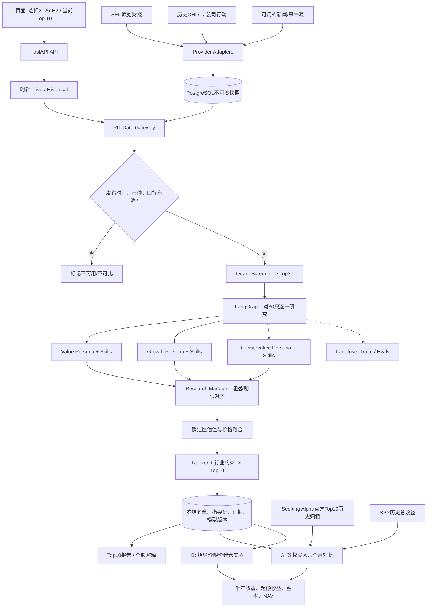
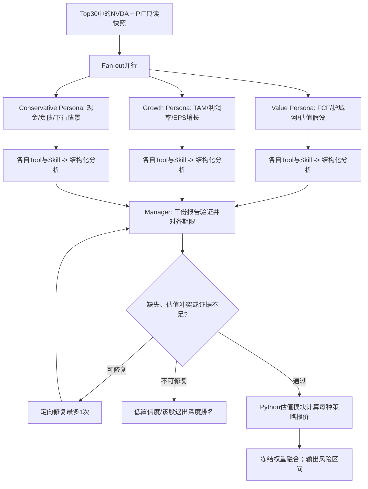
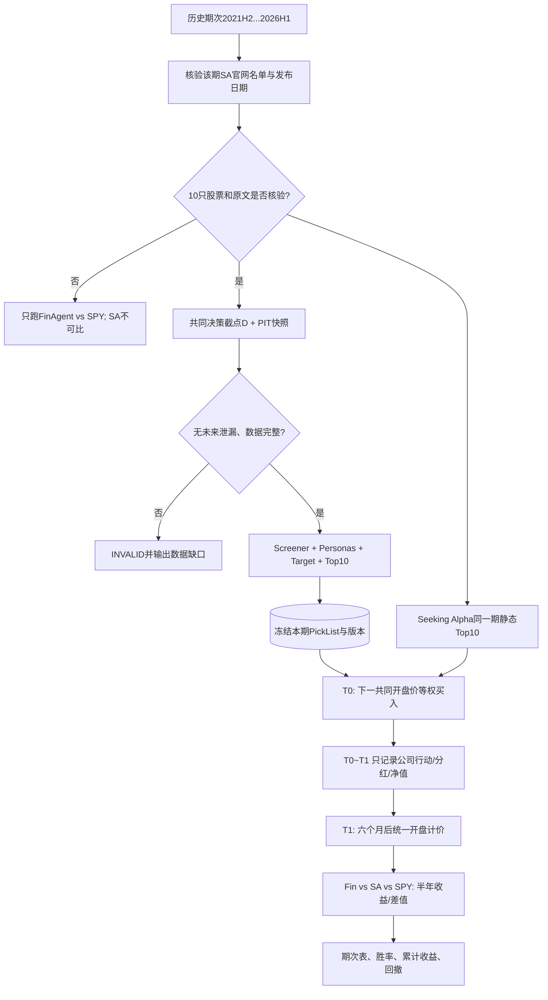

# FinAgent — Multi-Agent 半年 Top 10 智能选股系统

**系统设计文档（HLD + MVP 详细设计）｜V1.0｜2026-10-08**  
**状态：待方案评审；未编码、未进行真实回测；所有示例价格均为虚构数据。**

> **一句话目标**：每半年基于当时可获得的信息筛选 10 只在美国市场上市交易的股票/ADR；以独立 Persona Agent 研究和确定性估值生成 Top 10、未来 12 个月目标价与指导建仓价；用可复现的半年回测与 Seeking Alpha 同系列 Top 10、SPY 进行同口径比较。

## 0. 决策摘要

| 决策项 | V1 约定 | 理由 |
|---|---|---|
| 产品形态 | 每半年发布一期静态 Top 10，另附观察/建仓价 | 优先验证“会不会选股” |
| 主 KPI | 六个月 **FinAgent 等权组合总收益 − Seeking Alpha 同期等权组合总收益** | 与竞品对齐；不能拿其累计宣传收益直接比较 |
| 市场基线 | SPY 同期开盘买入、同日结算的总收益 | 检查是否优于大盘 |
| 选股方法 | PIT 量化初筛 → Top 30 → 3 Persona 并行独立研究 → 可解释估值 → Top 10 | Agent 用于非结构化研究与视角分离，数字由代码计算 |
| Agent 框架 | FastAPI + LangGraph + Pydantic | 易于 AI Coding、Python 金融生态成熟 |
| 回测方式 | 每半年独立等权建仓；下一可交易日开盘买入；六个月期末计价 | 不使用当日收盘后的未来价格来成交 |
| 12M 指导价 | 保留为**独立实验**，不混入主赛道 | 选股能力与等待买点是两个不同问题 |
| 5 年覆盖 | 目标 2021H2—2026H1，有效期数取决于官方榜单与 PIT 数据 | 不强行凑满 10 期；2026H2 尚未满半年 |
| 交付边界 | 一周完成可演示 MVP + 可运行回测框架；历史数据不足则标红并降低覆盖 | 禁止为了展示效果伪造 PIT 数据 |

### 不做的事

V1 **不提供自动下单、不提供卖点预测、不做杠杆/做空/复杂调仓、不声称稳定跑赢大盘、不复制 Seeking Alpha 的专有 Quant 公式**。回测中的六个月期末结算是评估定义，不等于对真实持仓给出卖出建议。

## 1. 背景、用户故事与成功标准

**用户故事 A：半年选股。** 用户选择 `2026-H1` → 系统在固定历史研究时点取得可用数据 → 量化初筛 → 三个投资 Persona 独立研究 → 输出 10 只股票及每只的估值、指导价、证据和风险。

**用户故事 B：竞品对照。** 用户选择“2025-H2” → 系统读取已核验 Seeking Alpha 同期原始 Top 10 及发布时间 → 为双方确定同一交易起始点与六个月终点 → 显示各自组合收益、SPY 收益、超额收益、持仓明细和数据缺口。

**用户故事 C：为什么选这只。** 用户点开 `NVDA`（以下价格全部是虚构示例） → 展示三位 Agent 的独立研究、各自估值假设、融合计算、参考来源与目标价分歧。

**硬验收：** (a) 没有未来数据进入决策；(b) 重要数字可回溯到原始数据/版本；(c) 冻结信号和输入后，可复现回测订单/收益；(d) 同一时期三组合起止时间一致；(e) 无 SA 原始榜单则标记不可比较，不填造；(f) 如实展示跑输结果。

## 2. 一个贯穿项目的具体例子

**场景（虚构数据）**：进入 `2025-H2` 的历史对比页。在 Seeking Alpha 该期官方榜单公布后，系统冻结共同决策时点 `D`；假定 NVDA 在 `D` 收盘可观察价格为 **$180**。以下日期、价格、估值、权重仅为流程演示，不代表真实 NVDA 行情或实际投资建议。

1. `Universe Service` 在 D 时点加载当时实际可交易证券名单、基础财务和历史行情；量化筛选取 Top 30。
2. `Evidence Builder` 为 NVDA 构建只读证据快照（数据采集时间、财报申报时间、价格 bar、来源哈希）。
3. `Value Agent` 以现金流/护城河方法提出假设，确定性估值程序算出 **12M $190**；`Growth Agent` 算出 **$240**；`Conservative Agent` 算出 **$160**。三者只读同一证据、使用各自消息历史。
4. `Research Manager` 检查三套估值**都是 12 个月、同拆股基准、同币种**；发现无法对齐则要求修正或退出，不自行凭感觉报价格。
5. 固定实验权重 `50% / 30% / 20%` → **12M 目标价 = $199**；`20%` 安全边际 → **示例建仓指导价 $159.20**。权重和边际是待验证候选，不代表最好策略。
6. `Ranker` 对所有候选统一计算评分（因子质量、估值空间、证据质量、风险），应用行业集中度限制，输出 Top 10。**即使 $180 高于指导价，NVDA 仍可能进入 Top 10 研究名单，但标注“观察/尚未满足建仓条件”。**
7. 主赛道对 Top 10 在双方共同起始日的下一可交易开盘价等权模拟建仓；六个月后用统一时点计价。副赛道才尝试等待 `$159.20` 的条件订单。

## 3. 整体架构和数据流



**隔离边界**：统一证据快照只读；三个 Persona 拥有独立 `messages`/工具白名单/执行轨迹；主 Graph 只合并结构化报告，不合并私有对话。`run_id + snapshot_id + ticker + persona + model_version` 作为执行标识。

### 技术模块边界

- `api`: 认证（本地演示可单用户）、路由、任务发起/状态/结果。
- `data`: 供应商适配、缓存、PIT 时点过滤、公司行动、完整性检查。
- `screener`: 可复现的量化因子、标准化、固定权重、候选排序。
- `agents`: LangGraph 主图、Persona 子图、Skills、结构化报告、审查。
- `valuation`: 纯 Python 估值函数、合理价值、12M 目标价、融合和建仓价。
- `portfolio`: Top 10 排名、行业约束、冻结名单。
- `backtest`: SA 官方名单核验、统一开盘模拟、六个月账本、绩效。
- `eval`: 工程质量、消融实验、泄漏检测、成本监控。
- `ui`: Top 10、个股解释页、回测看板。

## 4. 数据层与 Point-in-Time 约束

### 数据输入

| 数据 | 主来源/替代方向 | 更新时间 | PIT 风险与对策 |
|---|---|---|---|
| 历史交易日 OHLC、成交量 | 具备历史和公司行动接口的金融供应商 | 日级，MVP 足够 | 价格及拆股调整口径统一；保留原始 bar |
| 实时价格（可选） | 合规行情 API；必须标注交易所覆盖范围与延迟 | 秒级或供应商许可范围 | 只有“当前页面”需要，半年回测不依赖秒级数据 |
| 10-K/10-Q、XBRL | SEC EDGAR 原始申报与归档 | 季度/事件 | 用受理/披露时间，不用今天修订汇总冒充历史值 |
| 新闻及事件 | 有历史版本和时间戳的数据供应商 | 事件级 | 无可信历史原文则该历史 Agent 的新闻 Skill 关闭 |
| 分析师 EPS 修正 | 需要 PIT 授权数据 | 事件级 | V1 缺失时不回填、不假装 SA Quant 因子完整 |
| 股票上市、退市、公司行动 | 可覆盖当年历史证券集合的供应商 | 事件级 | 避免只使用今日幸存股票列表 |
| SA Top 10 榜单 | Seeking Alpha 官方发布链接，人工核验 10 个代码 | 半年 | 保存标题、发布时间、10只证券、截图/文档定位和核验人 |

PIT 核心约束：对每条特征均要求 `available_at <= decision_cutoff_utc`；价格 bar 的可见时间必须晚于 bar 结束时刻；财务数据要带 `period_end` 和实际 `published_at/accepted_at`，不能误把“报告期结束”当成“市场当时已知道”。由于大模型训练记忆可能含历史未来结果，Persona 的五年回测仍存在**模型知识泄漏**风险；需要匿名历史输入、限制自由网络工具，且不能对外宣称已完全消除。

### 数据不可用降级规则

1. **缺核心历史财务或公司行动**：该证券/期次标记 `DATA_UNAVAILABLE`，不使用今天的数据代替；不可纳入严格比较。
2. **新闻/分析师预期缺历史版**：关闭对应 Skill，记录 feature availability；允许 Quant-only 基线回测，但不能标成“完整多 Agent 策略”。
3. **缺 SA 官方名单或公开发布时间**：`SA_UNVERIFIED`，仅展示本系统与 SPY，不计算“战胜 SA”。
4. **历史 Universe 只有当前幸存公司**：标记 `SURVIVORSHIP_LIMITED`，回测结果仅为研究演示，不能作为可信五年全市场评测。

## 5. Quant Screener 与股票池

**目标**：在深度 LLM 分析前，以便宜、可复现的规则从 PIT 股票池中筛选最多30只。证券范围默认 NYSE/Nasdaq/NYSE American 上市普通股与满足条件的美国上市 ADR；不含 OTC、ETF、极低流动性证券（均可配置）。由于 SA 某些期次包含 ADR，竞品篮子保持官方原样；FinAgent 选股范围需在比赛前锁定并披露。

基础规则（均为可配置候选，不是事实最优值）：近60日平均日成交额、最少交易历史长度、财报数据覆盖率、停牌与退市状态、财务健全性；排除时必须留痕。上市历史不足的成长股不能因为缺少长期数据就无限制被填补，需要单独标注。

初筛因子参考 Seeking Alpha 公开的 **Value / Growth / Profitability / EPS Revisions / Momentum** 五维框架，但**不复制其专有打分**。V1 使用自建可复算指标，并在历史 EPS Revision 不可获得时改为“四因子模式”，自动记录 `factor_schema_version` 与剩余权重重归一，不与五因子结果混称。

推荐实现：对每期**在当时可得的横截面**使用 winsorize + 行业内 rank percentile；计算基础分，选 Top 30；禁止对全历史数据一次性标准化（这会泄漏未来分布）。可选候选权重：Value 25%、Growth 25%、Profitability 25%、Momentum 25%；EPS Revisions 获得 PIT 许可后加入独立实验。所有权重进入版本配置文件。

## 6. Multi-Agent 编排详细设计



**Agent 不是三套独立“知道未来”的大脑**：不同 Prompt 只带来分析偏好，统计错误仍高度相关。Persona 职责是提出有来源的假设与可证伪观点；数字必须经独立的计算工具重新计算。

| Agent | 专属 Skill | 主输入 | 结构化输出（节选） | 失败策略 |
|---|---|---|---|---|
| Value | DCF、FCF、ROIC、护城河证据 | 财报、历史估值 | `fcf_base, growth_range, discount_rate, fair_value_inputs` | 缺 FCF 则切换可比法并说明 |
| Growth | 收入增长、EPS、合理倍数 | 收入分部、历史 EPS | `forward_eps, fair_pe_range, scenario` | 增长区间超界则校验拒绝 |
| Conservative | 资产负债、偿债、压力情景 | 负债、现金流 | `downside_scenario, red_flags, safety_score` | 缺核心风险指标则标 `unknown` |
| Manager | 证据裁决与口径对齐 | 三份报告 | `validated_assumptions, conflicts, evidence_refs` | 不直接给最终价格 |

**工具调用限制**：每个 Persona 最多3次工具迭代、一次定向补救、30秒运行预算（初值，依模型实际延迟调整）；单批股票数量、LLM 并发限制、成本上限可配置。对同一历史 `snapshot + persona + prompt_version` 缓存结果，但变更 Prompt/模型/参数即生成新的实验版本。

**是否进行 Bull/Bear Debate**：V1 用功能开关作为消融实验；只允许一轮、只在观点冲突超阈值时触发，不能让辩论无限回路。正式排名先不依赖辩论结果，保留确定性基线。

## 7. 价格融合、指导价与 Top 10 排名

### 7.1 报价口径

三个 Persona 不能直接生成互不相干的美元数字。其结构化假设送入确定性估值函数，先形成**一致的未来12个月每股目标价**：

- Value: 财报和现金流驱动的当前公平价值，再根据明确的未来期间假设转换成 12M 目标；缺失足够历史 FCF 的公司，不强行运行 DCF。
- Growth: 未来 12M 可得的 EPS 预测 × 可解释的合理 Forward PE；负 EPS 不使用此方法，切换 EV/Sales 等明确适用方法并标注。
- Conservative: 压力情景下的保守目标价，同时用于风险惩罚；不把“最坏情景”误写为常态点预测。

为了 V1 可解释，可先采用固定配置 `w = [0.50, 0.30, 0.20]`，只有**方法、币种、拆股口径与12个月期限一致**的目标价可进入融合：

`target_12m = 0.50*T_value + 0.30*T_growth + 0.20*T_conservative`

虚构 NVDA 案例：`0.5*190 + 0.3*240 + 0.2*160 = $199.00`。如果某个模型不可用，不默默归一权重：改为注册的降级模型、重新计算并明确输出 `valuation_mode`。更复杂的加权/动态权重只能在训练区间拟合，然后冻结样本外测试。

### 7.2 建仓指导价

`entry_price = min(current_fair_value*(1-margin_of_safety), target_12m/(1+required_return))`

两个参数均由配置明确给出：安全边际先试 20%，最低要求收益率在训练阶段确定。为了和前述简化示例对应，若只启用 target 安全边际规则，则 `$199*(1-20%) = $159.20`。两个规则**不能混为一套**；必须在策略配置中明确记录 `entry_policy = TARGET_DISCOUNT` 或 `FAIR_VALUE_AND_RETURN`。

### 7.3 Top 10 排名

推荐 V1 可解释分数：`RankScore = 0.40*QuantScore + 0.35*ValuationUpsideScore + 0.15*EvidenceScore + 0.10*RiskScore`。四项均经截尾与尺度标准化。先固定权重，排名不看未来收益。加行业集中度上限（如每个 GICS 板块最多3只，具体可通过训练集检验），同分按照 ticker 字母顺序作可复现 tie-break。

**每期必须发布恰好10只吗？** 在数据满足质量门槛时输出10只；若股票池数据不足，系统返回不足10只和原因，不为凑数量而放宽 PIT 校验。状态为 `INCOMPLETE`，不纳入有效竞品比赛。

## 8. 半年回测：公平比较 Seeking Alpha

### 8.1 历史期次与竞品数据

回测目标窗为 **2021-H2 至 2026-H1**（名义10期）。当前日期2026-10-08；2026-H2 尚未过完半年，不可放入已完成胜率。必须先为每期保存：`sa_list_id, source_url, publication_timestamp, official_tickers[10], verified_at, reviewer, status`。官方记录可能有年度与半年榜单口径差异，找不到半年度原始榜单的期次标为 `SA_UNVERIFIED`，**绝不把 Alpha Picks 的每月推荐冒充 Top 10 半年榜单**。

Seeking Alpha 2026-H2 官方访谈明确将 Top 10 描述为**静态名单**，可能包含上市 ADR，并且其长期收益展示会跨多年持续持有。我们的公平比较必须从公开原始代码重新计算，**不能直接拿宣传的累计收益百分比做六个月对照**。

### 8.2 同一交易窗口

- `D`：双方信息均已可用的决策截点。可采取 `D = max(该期 SA 公开时间, FinAgent 预定评估时间)` 对应交易日**收盘之后**，FinAgent 历史研究只看 `<= D` 真实可用的数据。
- `T0`：`D` 之后的**第一个共同可交易市场开盘时刻**。两篮子与 SPY 均以此为起点买入或记账；不允许提前以 D 当日价格成交。
- `T1`：`T0 + 6个日历月` 后的第一个美国交易日开盘时刻（若恰逢休市顺延；相同的所有组合）。
- 每篮子初始现金相等、**10只股票各10%权重**；V1 只建立多头，不对中途股票排名变更调仓。
- 用模拟账本执行 T0 买入与 T1 的**基准结算**（计价/虚拟期末平仓），对价格口径保持一致，并模拟公司行动、分红、费用、滑点；公布含与不含成本版本。
- 两方候选证券交易日/退市存在差异时，按预先固定的公司行动/退市事件处理，**禁止删掉亏损、停牌、退市股票**。无法定价则标记 `INCOMPLETE` 并暂停比较。

### 8.3 结果指标

- **半年收益**：`R_Fin = NAV_Fin(T1)/NAV_Fin(T0)-1`；`R_SA`、`R_SPY` 同理。
- **对标差**：`Excess_SA = R_Fin-R_SA`（单位为百分点）；`Excess_SPY = R_Fin-R_SPY`。
- **半年胜率**：`count(Excess_SA > 0)/count(已成熟且可比较的半年期次)`；同时公开分母（如 `5/7`），不把未成熟/缺失期次算成成功。
- **个股命中率**：FinAgent Top 10 中单股半年总收益大于 SPY 同期总收益的比例，仅为辅助指标。
- **累计收益**：连续有效不重叠期次按 `(1+R_i)` 复利连乘；若中间缺一期，应明确显示断档，不能把不连续期次称为五年连续资金曲线。
- **风险**：日度模拟 NAV 的最大回撤、波动率；半年度样本最多约十期，不对统计显著性作夸大推断。

**结果表示例（虚构，非真实回测）：**

| 期次 | FinAgent 半年总收益 | SA 半年总收益 | SPY | Fin-SA | 结果 |
|---|---:|---:|---:|---:|---|
| 示例 2025-H2 | +16.0% | +11.0% | +8.0% | +5.0pp | 跑赢 |
| 示例 2026-H1 | +3.0% | +7.0% | +6.0% | -4.0pp | 跑输 |

### 8.4 指导建仓价的独立回测（副赛道）

同一批 Top 10 信号另建**独立账本**：T0 后最多30个日历天有效的限价买单（或配置的有效期），只有下一开盘价满足建仓限价，才按保守模拟成交约定建仓；未触发时持有现金。期末 T1 同样计算 NAV；对比“直接等权买入”与 SPY，公开未成交率、资金利用率与错过上涨的机会成本。这是独立指标，**绝不改变主赛道的 SA 对标结果**。

## 9. 回测执行流程图



**反作弊测试**：特征 `available_at` 晚于 D 时应被严格拒绝；改动未来六个月的价格不得改变在 D 生成的选股名单；对公司拆股/退市、同日事件顺序、盘前/盘后披露、SEC 重述数据分别建单元/集成用例。

## 10. Agent 的效果如何衡量（与策略收益分开）

**投资层面的四组消融实验**，同一期次、同数据快照、同股票池、同排名约束和成本模型：

| 组别 | 研究方式 | 比较目的 |
|---|---|---|
| A | Quant Screener + 确定性估值（无 LLM） | 最重要的无 Agent 基线 |
| B | Single-Agent + 全部 Skills | 验证是否必须使用多个 Agent |
| C | 三 Persona、上下文隔离并行 + 融合 | 验证独立角色的增量价值 |
| D | C + 一轮有条件 Bull/Bear | 验证辩论是否值得 Token 成本 |

除主要半年超额收益，还要比较名单重复率、10只个股命中率、模型调用次数、Token 成本、P95 延迟。**只有 C 对 B 的样本外改进，才支持“Multi-Agent 优于 Single-Agent”；只有 D 对 C 的改进才支持辩论。** 本项目研究结果不构成统计上确凿的投资优势。

**工程层评测**：工具选择正确率、数据溯源覆盖率、数字重算一致率、JSON Schema 合法率、故障恢复率、跨 Persona 消息隔离测试、PIT 拒绝测试、同配置重复运行订单级一致性。Langfuse 记录 `trace_id/run_id/persona/model/prompt_version/snapshot_id/tokens/latency/errors`。同种模型可能含相同历史知识，靠不同人格提示词并不能实现认知独立。

**历史 LLM 回测污染警告**：2026年的模型可能记得2022—2025的真实牛熊和个股结果，哪怕数据接口严格 PIT。执行历史 Persona 回测时应匿名 ticker 和日期、只提供截断历史证据；但**仍不能保证杜绝训练记忆污染**，因此 A 组量化确定性回测与真正上线后的前瞻纸面跟踪是主要可信验证。

## 11. 数据库、接口与任务协议

### 11.1 关键持久化实体

| 表 | 关键字段 | 设计目的 |
|---|---|---|
| `instruments` | `instrument_id, ticker, exchange, list_at, delist_at, currency` | PIT 股票池，ticker 变更历史另记 |
| `market_bars` | `instrument_id, bar_time, open, high, low, close, volume, data_version` | 原始价格、交易日数据 |
| `corporate_actions` | `instrument_id, action_time, action_type, ratio, amount` | 拆分、分红、退市结算 |
| `data_snapshots` | `snapshot_id, cutoff_at, sha256, provider, schema_version, status` | 不可变历史快照 |
| `financial_facts` | `instrument_id, period_end, accepted_at, fact_name, value, filing_id, version` | 历史事实和修订版 |
| `agent_runs` | `run_id, snapshot_id, role, prompt_version, llm_model, trace_id, status` | Agent 会话隔离/观测 |
| `agent_reports` | `run_id, method, structured_assumptions_json, evidence_refs` | Persona 研究结果 |
| `valuation_results` | `snapshot_id, instrument_id, model_version, target_12m, entry_price, assumptions_json` | 估值可复算 |
| `pick_lists` / `pick_items` | `period, decision_at, locked_at, rank, instrument_id, weight, model_version` | 冻结半年 Top 10 |
| `sa_lists` / `sa_items` | `period, published_at, source_url, verified, ticker` | 竞品原始归档 |
| `backtest_runs` | `run_id, universe_version, assumptions_hash, start, end, status` | 独立实验、重跑审计 |
| `sim_orders` / `nav_daily` / `metrics` | `run_id, date, instrument, action, fill_price, cost, nav, metric_value` | 模拟成交与结果 |

### 11.2 HTTP API（V1）

| HTTP | API | 请求 | 响应 |
|---|---|---|---|
| `POST` | `/api/v1/picks/runs` | `{period, mode, config_id}` | `{run_id, status}` |
| `GET` | `/api/v1/picks/runs/{run_id}` | — | 执行状态、成本、错误、快照 |
| `GET` | `/api/v1/picks/{period}` | — | 冻结 Top10，逐只目标价/指导价/来源 |
| `GET` | `/api/v1/stocks/{ticker}/research?period=...` | — | Persona 结果、假设、证据 |
| `POST` | `/api/v1/backtests` | `{periods, strategy_mode, benchmark}` | `{backtest_id, status}` |
| `GET` | `/api/v1/backtests/{id}` | — | 单期收益、对标、净值、数据质量 |
| `GET` | `/api/v1/benchmarks/sa/{period}` | — | SA 名单、发布来源、核验状态 |
| `GET` | `/api/v1/evals/{experiment_id}` | — | 消融和 Agent 指标 |

`POST /runs` 应幂等：同一个 `(period, config_hash, snapshot_hash)` 默认返回已有结果；显式 `force=true` 创建不同 run。所有可能耗时的任务返回 `202 Accepted`，通过任务状态轮询；一周 MVP 先用 FastAPI BackgroundTasks/进程内任务队列做演示，生产需要独立队列与 worker 才能保证进程重启后任务不丢失（不可误称具备生产级可靠性）。

### 11.3 示例输出（全部虚构）

```json
{
  "period": "2025-H2",
  "ticker": "NVDA",
  "decision_at": "EXAMPLE-DECISION-CUTOFF",
  "snapshot_id": "demo_snapshot_001",
  "price_at_decision": 180.0,
  "target_price_12m": 199.0,
  "entry_price": 159.2,
  "entry_rule": "TARGET_DISCOUNT_20PCT",
  "status": "WATCH",
  "persona_targets": {"value": 190, "growth": 240, "conservative": 160},
  "weights": {"value": 0.5, "growth": 0.3, "conservative": 0.2},
  "evidence_refs": ["demo_filing_ref_001"],
  "model_version": "v1-demo",
  "data_quality": "ILLUSTRATIVE_ONLY"
}
```

## 12. Web 产品页面

1. **Top 10 首页**：期次筛选、Top 10、行业分布、股票评分、12M 目标价、指导价、WATCH/满足价格条件、数据新鲜度。
2. **个股研究详情**：三个 Persona 的结构化观点、对估值假设的分歧、原始证据、计算步骤、风险清单。
3. **Backtest Compare**：FinAgent / SA / SPY 同口径半年收益表、NAV 曲线、胜负场次、缺失期次明细、交易成本开关。
4. **实验与审计**：A/B/C/D 消融对照、Token/延迟、每次执行的输入哈希、数据完整性警告。

前端可以使用 React + Recharts；不做复杂 K 线交易终端。半年度选股用日线足够，实时行情第一版非核心阻塞项。

## 13. 7 天 AI Coding 实施计划与验收

| 天数 | 实施任务（由 AI Coding 执行） | 当天验收 |
|---|---|---|
| D1 | FastAPI/React/PG 工程骨架；迁移脚本；配置版本；三份模拟数据 Fixture | 一键启动，健康检查，模拟 Top10 页面 |
| D2 | Market/SEC 适配器；PIT Clock/Gateway；公司行动接口；历史可得性扫描 | 未来披露数据被拒；数据缺失可定位 |
| D3 | Quant Screener、因子标准化、Top30、Top10 排名、估值纯函数 | 固定输入名单可复现；目标价重算一致 |
| D4 | LangGraph 三 Persona、工具权限隔离、Manager、结构化输出、限额 | 三个上下文互不泄漏；并行故障有降级报告 |
| D5 | SA 官方名单导入/核验；统一 T0/T1；模拟组合、SPY、数据质量结果 | 至少一份**核验过的**期次可真实比较；不足则明确 BLOCKED |
| D6 | 五年批处理、消融配置、预测/收益指标、回测页面、审计导出 | 全量扫描显示可比/不可比期数与原因 |
| D7 | 端到端测试、异常注入、Docker Compose、README、演示脚本 | `pytest` 通过；新环境启动；结果可重复 |

**交付风险说明**：五年 *Quant-only* 基线可在准备好 PIT 日线与财务数据后批量回放；“五年完整三 Persona 可信回测”需要覆盖历史版本的新闻/财务、较多模型调用与训练知识泄漏控制，**不应承诺一周内必定取得有效真实成绩**。一周验收以完成结构与至少一个真实可比期次为底线，再逐步扩容。

### 分工（默认用户只 Compose）

| 内容 | 我负责 | AI Coding 负责 | 你负责 |
|---|---|---|---|
| 架构与流程 | 流程图、权衡、接口契约、方案审查 | 按合同实现 | 决策评审 |
| 开源策略复用 | 检索、验证适用性、检查 License、选计算方法 | 工程适配、单测 | 无需自己写策略 |
| 金融数据 | 给出供应商、PIT 与对标核验规则 | 实现 Adapter 与导入 | 如有需要，申请账号并**本地**配置 Key |
| 回测与评测 | 对齐规则、反作弊用例、指标与实验设计 | 运行代码与生成报表 | 复核结果及可解释性 |
| 交付与简历 | README 架构、真实可量化指标整理 | CI、Docker、日志 | 项目验收/选择是否继续 |

## 14. 测试矩阵与不可妥协的验收标准

- `PIT-01`：2025-06-01 决策读取 2025-06-30 发布数据 → 必须拒绝。
- `PIT-02`：将未来半年的价格修改为100倍，**不能改变已冻结的当期选股名单**。
- `SA-01`：SA 少一只、没有可信发布日期、年度名单混入半年名单 → 标 `SA_UNVERIFIED`。
- `EXE-01`：收盘后生成信号，不能用当天开盘建仓；双方用完全相同 `T0/T1`。
- `EXE-02`：退市股票、拆股、现金分红按公司行动正确进入 NAV；不丢弃亏损样本。
- `MODEL-01`：权重不等于1、不同币种/预测期限、负EPS套PE → 校验失败或显式降级。
- `AGENT-01`：Value Agent 的私有消息不能出现在 Growth Agent 的输入中；共享证据仅只读。
- `AGENT-02`：不可用的历史新闻 Skill 不得自动联网检索未来网页。
- `REPRO-01`：同 `snapshot_hash+config_hash+frozen_signal_hash` 的模拟回测逐单一致；历史重跑可复查。
- `METRIC-01`：平均半年超额收益与半年胜率按**成熟、可比期数**计算；报告分母与缺失原因。
- `UI-01`：结果页面必须同时允许显示跑赢、跑输、无可比数据三种状态。

**一周 MVP 的完成定义**：运行稳定、可解释、有真实归档来源的回测报告与可靠的缺失提示；不是“必须获得超过 Seeking Alpha 的收益”。

## 15. 未解决问题、风险与最终评审

| 风险/待决 | 严重度 | 具体处理 |
|---|---|---|
| 2021—2026 每半年 SA 官方 Top 10 名单覆盖不完整 | 高 | 先制作来源台账；有多少可信期数就报告多少，不能编造 |
| 历史股票 Universe 含幸存者偏差 | 高 | 需要当期上市/退市证券表，否则明确限制结果用途 |
| 历史财报、分析师共识缺 PIT 数据 | 高 | 保留原始 filings，缺共识时关闭相关因子；不可“偷看未来” |
| 2026 模型记得历史股价结果 | 高 | Persona 历史回测定位为污染敏感实验；主要依靠量化基线+前瞻纸面实验 |
| 三 Persona 预测错误相关性强 | 中 | A/B/C/D 消融，事实与 Tool 校验，不宣称人格多样化自动改善收益 |
| 一期10只、最多10期统计样本小 | 高 | 报告期数、置信区间/不确定性，不用“胜率90%”夸大结论 |
| 策略参数在测试集反复调优 | 高 | 训练期选择参数，未来期冻结；提供 Walk-forward 实验配置 |
| 复杂异步架构一周超期 | 中 | V1 先单服务、限并发、PG 和 Docker；Redis/Kafka/Doris 之后再做 |

### 设计自评（设计覆盖度，不是实测成绩）

- 业务闭环：**完整** —— 初筛、Persona、估值、Top10、比较、审计均有定义。
- 金融工程可信度：**条件成立** —— 取决于 SA 原文和可回溯 PIT 数据；严禁在缺数据时声称已回测五年。
- 一周可交付性：**MVP 有条件可行** —— 数据获取与许可是最大外部风险；不应同时追求生产级数据平台。
- 项目对面试的价值：**较高** —— 可以对比单/多 Agent，展示上下文隔离、结构化 Tool、状态编排、可复现回测与实验设计。
- 投资有效性：**未知** —— 没有任何真实测试结果，不承诺跑赢 Seeking Alpha 或 SPY。

### 设计评审时需要你最终批准的默认配置

1. 选股范围：美国交易所普通股 + 符合条件的上市 ADR；竞品篮子保留官方原样。
2. 主赛道：Top10 各10%、统一 T0 开盘买入、持有六个月、T1 开盘计价，不另做卖出判断。
3. 核心 KPI：半年相对 SA 超额收益、胜率；SPY 作为第二基准。
4. 深度研究：Top30 × 3 Persona；Manager 只对齐证据；辩论先作为可选实验。
5. 模型：先固定透明权重与估值方案，再采用独立历史区间调优，绝不提前看测试成绩。
6. 外部依赖：LLM Key 与真实历史价格/财务数据权限；若支付授权数据缺失，缩小已核验回测覆盖。

## 16. 公开参考与复用边界

1. TradingAgents 编排源码：<https://github.com/TauricResearch/TradingAgents/blob/main/tradingagents/graph/setup.py> —— 并行 Analyst、Bull/Bear、Manager 与条件路由。
2. AI Hedge Fund v2：<https://github.com/virattt/ai-hedge-fund/blob/main/hedge_fund/README.md> —— Investor Persona、AlphaModel、统一回测执行路径、模拟经纪商。
3. FinRobot V2：<https://github.com/AI4Finance-Foundation/FinRobot> —— 代码计算估值、模型审计、LLM 解释与来源校验。
4. VectorBT：<https://github.com/polakowo/vectorbt/blob/master/docs/docs/getting-started/usage.md> —— `Portfolio.from_signals()` 和研究级批量策略试验；复杂期次/公司行动仍需自定义适配。
5. OpenBB Agent 参考：<https://github.com/OpenBB-finance/experimental-openbb-platform-agent> —— 可借鉴 Provider/Tool 思想，但该实验仓库已归档，不作为直接依赖。
6. Seeking Alpha 2025-H2：<https://seekingalpha.com/article/4794446-top-10-stocks-for-h2-2025> —— 官方半年 Top10 参照，完整名单须核验。
7. Seeking Alpha 2026-H2：<https://seekingalpha.com/article/4911611-top-10-stocks-for-h2-2026> 与 <https://seekingalpha.com/article/4922069-top-stocks-for-h2-2026-replay> —— 官方 Top10 静态名单与口径说明。
8. SEC EDGAR API：<https://www.sec.gov/search-filings/edgar-application-programming-interfaces> —— 原始 filings 和公司结构化财务。

**版权与许可原则**：引用开源项目时保留原许可证及声明；Seeking Alpha 的历史名单由官方来源人工核实，不大规模抓取付费内容或复制其专有因子、付费评分模型。
